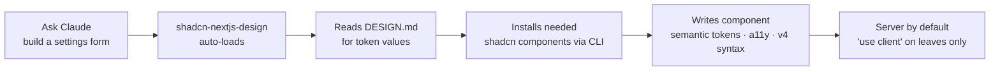
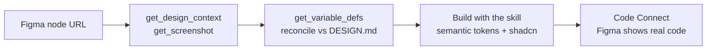

<div align="center">

# 🎨 shadcn-skills-design-starter

### A Next.js + shadcn/ui starter wired to a **Figma-driven design-token system** — with a full **Claude Code skill suite** baked in.

Browse 54 live components, build UI with semantic tokens, and let Claude Code design, review, and verify your work — all following the same rules, automatically.

<br/>


</div>

---

## 📑 Table of contents

- [What's inside](#-whats-inside)
- [Quick start](#-quick-start)
- [Components](#-components)
- [The component docs site](#-the-component-docs-site)
- [Storybook](#-storybook)
- [Project structure](#-project-structure)
- [Design-token system](#-design-token-system)
- [The Claude Code skill suite](#-the-claude-code-skill-suite)
- [Workflows](#-workflows) — _the detailed part_
- [Figma integration](#-figma-integration)
- [Scripts & verification](#-scripts--verification)

---

## ✨ What's inside

| Area | What you get |
| ---- | ------------ |
| **Framework** | Next.js **16** (App Router, Turbopack) · React **19** · TypeScript · ESLint |
| **Styling** | Tailwind CSS **v4** — CSS-first config (`@theme` in CSS, no `tailwind.config.js`) |
| **Components** | **shadcn/ui** (radix base) — **54 components** documented in a live explorer (full list [below](#-components)) |
| **Design tokens** | **1,812 tokens** from Figma → mirrored in `DESIGN.md` → wired into `globals.css` (light + dark) |
| **Docs site** | An interactive component explorer with **⌘K palette**, URL routing, and token reference pages |
| **Theming** | `next-themes` dark mode + **Sonner** toaster, ready in the root layout |
| **AI assistance** | **18 Claude Code skills** — 1 project skill (`shadcn-nextjs-design`) + a 17-skill design suite |
| **Quality** | WCAG 2.2 AA verified · Playwright click-through harness · accessibility & design-review skills |

## 🚀 Quick start

```bash
npm install
npm run dev          # → http://localhost:3000
```

| Script | What it does |
| ------ | ------------ |
| `npm run dev` | Start the dev server (Turbopack) |
| `npm run build` | Production build |
| `npm run start` | Serve the production build |
| `npm run lint` | Run ESLint |
| `npm run storybook` | Start Storybook (→ http://localhost:6006) |
| `npm run build-storybook` | Build the static Storybook |

Add more shadcn components anytime:

```bash
npx shadcn@latest add card dialog table input label
```

---

## 🧩 Components

**54 components**, each with a live demo + copy-paste code in the docs site, and an isolated story in
[Storybook](#-storybook). Grouped by category as they appear in the sidebar:

| Category | Components |
| -------- | --------- |
| **Forms** (17) | Input · Textarea · Select · Native Select · Checkbox · Radio Group · Switch · Slider · Toggle · Toggle Group · Calendar · Date Picker · Input OTP · Combobox · Field · Input Group · Form |
| **Display** (10) | Badge · Card · Avatar · Table · Data Table · Separator · Carousel · Chart · Item · Kbd |
| **Overlay** (9) | Dialog · Alert Dialog · Sheet · Drawer · Popover · Dropdown Menu · Context Menu · Tooltip · Hover Card |
| **Feedback** (6) | Alert · Progress · Skeleton · Spinner · Empty · Sonner (toast) |
| **Navigation** (5) | Tabs · Breadcrumb · Pagination · Navigation Menu · Menubar |
| **Layout** (3) | Resizable · Scroll Area · Aspect Ratio |
| **Actions** (2) | Button · Button Group |
| **Disclosure** (2) | Accordion · Collapsible |

> Every component uses semantic design tokens (light + dark), ships the relevant ARIA / keyboard
> behavior, and is installed via the shadcn CLI — none are hand-rolled.

### Interaction states

Form controls are documented across their **full interaction-state set in both code _and_ Figma** —
so the design library and the components stay in lock-step:

| State | Code (Tailwind) | Figma variant |
| ----- | --------------- | ------------- |
| **Default** | base classes | `State=Default` |
| **Focus** | `focus-visible:ring-ring/50` | `State=Active` |
| **Error / Invalid** | `aria-invalid:border-destructive` · `aria-invalid:ring-destructive/20` | `State=Invalid` |
| **Disabled** | `disabled:opacity-50` | `State=Disabled` |

The **Error/Invalid** and **Disabled** variants were added to the Figma component library across the
form family — Input, Textarea, Select, Native Select, Input OTP, Checkbox, Radio, Field, Button,
Switch, Slider — every variant **bound to design tokens** (`destructive`, `opacity-50`), never
hardcoded. States are token-driven, so they flip correctly in light **and** dark mode.

---

## 🧭 The component docs site

`src/app/page.tsx` renders a self-contained **component explorer** (the `DocsShell`) — your living
style guide.

```
┌──────────────┬───────────────────────────────────────────────┐
│  Skill UI    │  Components › Button                    ⌘K  ◑  │
│              ├───────────────────────────────────────────────┤
│ Getting…     │  Button                                       │
│ • Intro      │  Displays a button or a component that looks   │
│ • Install    │  like a button, with multiple variants.       │
│              │                                               │
│ Design Tokens│  Installation                                 │
│ • Colors     │  > npx shadcn@latest add button          ⧉    │
│ • Typography │                                               │
│ • Spacing    │  Example   [ Preview | Code ]                 │
│ • Radius     │  ┌─────────────────────────────────────────┐ │
│ • Shadows    │  │  Primary  Secondary  Outline  Ghost  …   │ │
│ • Icons      │  └─────────────────────────────────────────┘ │
│              │                                               │
│ Components    New                                            │
│ • Accordion  ◀ active                                        │
│ • Button     …54 total                                       │
└──────────────┴───────────────────────────────────────────────┘
```

**Features**

- 🔍 **⌘K command palette** — fuzzy-jump to any component or token page
- 🔗 **URL routing** — every page is linkable / bookmarkable (`/?p=button`) and **Back/Forward works**
  (built on `useSyncExternalStore` — SSR-safe, zero hydration mismatch)
- 🎨 **Token reference pages** — Colors, Typography, Spacing, Radius, Shadows, Icons
- 🌗 **Light / dark** toggle, every component shown in both
- ♿ **Accessible** — single `<main>` landmark, focus moves to content on navigation, `aria-live` page
  announcements, WCAG-AA contrast throughout

---

## 📚 Storybook

Every `src/components/ui/*` component also ships a **Storybook** story for isolated development, visual
review, and a11y checks.

**▶ Live Storybook (deployed on Chromatic):**
**https://main--6a3386f159568e66e837d6d0.chromatic.com**

```bash
npm run storybook         # → http://localhost:6006 (local dev)
npm run build-storybook   # static build into storybook-static/
npx chromatic --project-token=<token>   # publish the static build to Chromatic
```

- **Stack** — Storybook 10 with the **`@storybook/nextjs-vite`** framework (official Next 16 + React 19
  support). Tailwind v4 is picked up through the project's existing `postcss.config.mjs`.
- **Addons** — `addon-docs` (autodocs), `addon-a11y` (the **A11y** tab runs axe on every story), and
  `addon-themes` (a toolbar toggle flips the canvas between **light / dark**).
- **Stories** live in `src/stories/<Component>.stories.tsx` (one per UI component), titled
  `Components/<Name>`. They load `globals.css` so the same design tokens + Geist fonts apply.

> Stories are validated by `build-storybook` (Vite) and are intentionally **excluded from the Next.js
> type-check** — `npm run build` compiles the app, `npm run build-storybook` compiles the stories.

---

## 📁 Project structure

```
.
├── src/
│   ├── app/
│   │   ├── globals.css            # design tokens (DESIGN.md §1) + Tailwind v4 @theme
│   │   ├── layout.tsx             # Providers + Sonner Toaster
│   │   ├── providers.tsx          # next-themes ThemeProvider ("use client")
│   │   └── page.tsx               # renders <DocsShell />
│   ├── components/
│   │   ├── ui/                    # 54 shadcn components — never edit directly; wrap/extend
│   │   ├── docs/                  # the docs explorer (shell, registry, demos, previews)
│   │   └── layout/                # app-sidebar · command-menu · mode-toggle
│   ├── hooks/                     # use-mobile, …
│   └── lib/utils.ts               # cn() helper
│
├── .claude/
│   └── skills/
│       ├── shadcn-nextjs-design/  # ★ PRIMARY skill — build rules + DESIGN.md token registry
│       ├── _ux-ui-shared/         # vendored support bundle for the design suite (reference only)
│       └── …17 ux-ui-* skills     # design-tokens, a11y-audit, design-review, ux-writing, …
│
├── .figma/                        # Code Connect mappings (*.figma.ts)
├── CLAUDE.md                      # repo guidance for Claude Code (read every session)
├── AGENTS.md                      # Next.js 16 notes (create-next-app)
└── components.json                # shadcn config
```

---

## 🎨 Design-token system

The **Figma file is the source of truth.** Tokens live in
**[`DESIGN.md`](.claude/skills/shadcn-nextjs-design/DESIGN.md)** (1,812 variables) and are applied as
semantic CSS variables in `src/app/globals.css` — so light/dark and theming work from one place.

```tsx
// ✅ Always use semantic tokens — they handle light/dark automatically
<div className="bg-background text-foreground border border-border">
  <p className="text-muted-foreground">Subtle text</p>
  <span className="text-success">Saved</span>
</div>

// ❌ Never hardcode colors
<div className="bg-white text-gray-900">…</div>
```

| Layer | Token examples |
| ----- | -------------- |
| **Surfaces** | `bg-background` · `bg-card` · `bg-popover` · `bg-muted` |
| **Actions** | `bg-primary` · `bg-secondary` · `bg-destructive` · `text-success` |
| **Text** | `text-foreground` · `text-muted-foreground` |
| **Lines** | `border-border` · `border-input` · `ring-ring` |
| **Radius** | `rounded-xs` (4px) · `rounded-md` (6px) · `rounded-lg` (8px, base) |

> **The golden rule:** keep `DESIGN.md` and `globals.css` in sync with Figma — **never hand-diverge
> token values.** Sync flows one way: **Figma → `DESIGN.md` → `globals.css`**.

---

## 🤖 The Claude Code skill suite

This repo ships **18 skills** under `.claude/skills/`. They **auto-load** by relevance whenever you
ask Claude Code to build, style, review, or document UI.

### ★ Primary skill — `shadcn-nextjs-design`

The one to reach for on any UI task. It enforces this project's rules: **semantic tokens only**,
**shadcn via CLI**, correct **server/client** boundaries, **accessibility**, and **Tailwind v4** syntax
— and its `DESIGN.md` is the **token source of truth**.

```text
Auto-loads on UI work · or invoke explicitly:  /shadcn-nextjs-design
```

### The 17-skill design suite (`ux-ui-agent-skills`)

A vendored "Senior Design Architect" toolkit. Support files live in `.claude/skills/_ux-ui-shared/`;
each skill is invocable via `/<name>`.

<details>
<summary><b>Show all 17 skills</b></summary>

| Skill | Use it for |
| ----- | ---------- |
| `design-tokens` | Generate / extend / validate DTCG tokens |
| `design-component` | Spec a component (anatomy, variants, 8 states, a11y) |
| `design-code` | Generate component code for **any** framework |
| `design-review` | Score a UI across 6 dimensions + Nielsen heuristics |
| `a11y-audit` | WCAG 2.2 AA/AAA audit with measured contrast |
| `ux-writing` | Buttons, errors, empty states, microcopy |
| `performance` | Core Web Vitals (LCP / INP / CLS) |
| `design-qa` | CI gates — token lint, axe, visual regression |
| `apply-aesthetic` | Apply a look / vibe (138 named systems) |
| `brandkit` | Generate a full brand token system from a brief |
| `figma-integration` | Token ↔ Figma Variable sync, Code Connect |
| `governance` | SemVer, contribution, deprecation policy |
| `token-build` | Token pipeline → CSS / Tailwind / iOS / Android |
| `prototype` | Fidelity ladder, user flows, usability testing |
| `redesign` | Modernize an existing UI surgically |
| `image-to-code` | Screenshot / mockup → token-driven code |
| `migrate-design-system` | Bridge to/from Material, HIG, Carbon, Ant… |

</details>

> 🛡️ **Figma stays authoritative.** The suite is **reference/process aid only** — it must defer to
> **Figma → `DESIGN.md` + `globals.css`** for tokens and **never** emit the bundled
> `_ux-ui-shared/tokens/*.json` values or create a second `:root`/`@theme`. This is enforced by a
> `PROJECT OVERRIDE` banner in `_ux-ui-shared/CLAUDE.md` and `PROJECT NOTE` banners on the
> token/code/Figma skills.

---

## 🔄 Workflows

### 1️⃣ Browse & copy a component

```text
npm run dev  →  open localhost:3000  →  ⌘K "dialog"  →  copy the install command + example
```

The docs site is your catalogue: find a component, read its description, copy
`npx shadcn@latest add <name>`, and grab the usage example from the **Preview / Code** tabs.

### 2️⃣ Build new UI with Claude Code



Just describe what you want. The skill pulls real token values from `DESIGN.md`, installs missing
shadcn pieces via the CLI, and writes code that respects the server/client boundary and accessibility
rules — no hardcoded colors, correct Tailwind v4 (`size-4`, `gap-*`, `rounded-xs`).

### 3️⃣ Design → Code from Figma



1. **Read** the design — `get_design_context` (or `get_screenshot`) on the Figma node
2. **Pull tokens** — `get_variable_defs`, reconcile against `DESIGN.md`
3. **Build** with `shadcn-nextjs-design` — semantic tokens + shadcn components
4. **Map back** — add a `.figma/*.figma.ts` Code Connect file so Figma's Dev panel shows your code

### 4️⃣ Review, audit & verify

```text
/design-review   → 6-dimension score + prioritized findings (Nielsen heuristics)
/a11y-audit      → WCAG 2.2 findings with MEASURED contrast (never eyeballed)
                   python3 .claude/skills/_ux-ui-shared/scripts/contrast.py "#fg" "#bg"
```

For real-browser confidence, the repo includes a **Playwright** dev dependency. A typical
click-through verifies deep-links, sidebar navigation, Back/Forward, focus management, and landmark
structure end-to-end before you ship.

> 💡 This very starter was hardened that way: a `/design-review` surfaced a failing `text-emerald-500`
> contrast (2.54:1) and a duplicate `<main>` — both fixed (a semantic `--success` token at 5.48:1 /
> 10.3:1, single landmark), then confirmed with a 12/12 Playwright run.

---

## 🔗 Figma integration

Configured in `CLAUDE.md`:

```text
FIGMA_FILE_URL:  https://www.figma.com/design/HfydkFEyj2PY0tpZMz7i3K/…
FIGMA_FILE_KEY:  HfydkFEyj2PY0tpZMz7i3K
```

Connected via the **Figma MCP** (`mcp.figma.com`, OAuth at runtime — no keys in the repo). Key tools:
`get_design_context` · `get_screenshot` · `get_metadata` · `get_variable_defs` ·
`get_code_connect_map` · `search_design_system`.

When Figma tokens change, refresh `DESIGN.md` then `globals.css` — don't hand-edit values to diverge.

---

## 🧪 Scripts & verification

Beyond the npm scripts, the design suite bundles runnable gates under
`.claude/skills/_ux-ui-shared/scripts/`:

| Script | Checks | Needs |
| ------ | ------ | ----- |
| `contrast.py` | WCAG contrast for any `fg`/`bg` pair | python3 |
| `measure_render.mjs` | Real-render contrast of every text element | Playwright |
| `verify_states.mjs` | Contrast in default / hover / focus states | Playwright |

```bash
npm i -D playwright && npx playwright install chromium   # one-time, for the render gates
```

---

> ⚠️ **Next.js 16 has breaking changes** vs older conventions. See `AGENTS.md` and
> `node_modules/next/dist/docs/` before reaching for unfamiliar Next APIs.

<div align="center">
<br/>
<sub>Built with <b>Next.js</b> · <b>shadcn/ui</b> · <b>Tailwind CSS v4</b> · <b>Figma</b> · <b>Claude Code</b></sub>
</div>
